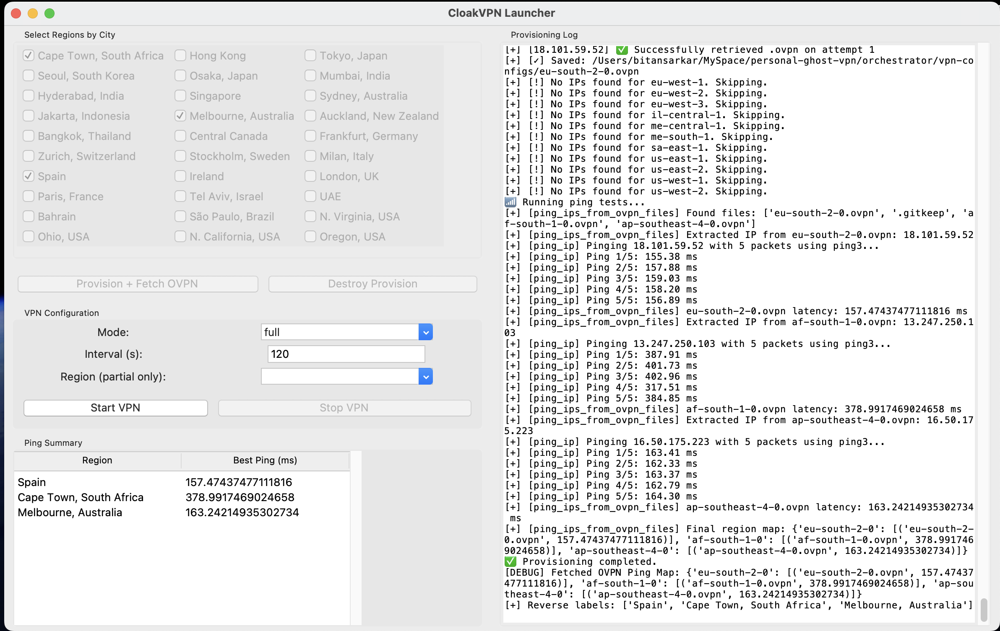
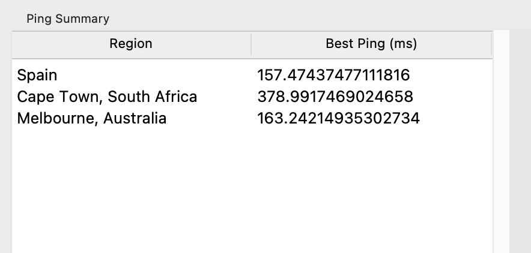
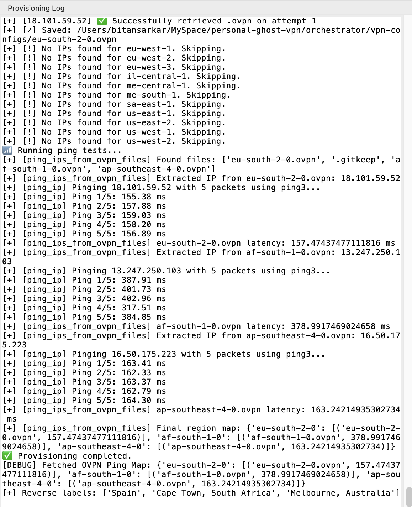

# 🕵️ CloakVPN – A Stealthy, Self-Hosted Rotating VPN System

CloakVPN is a fully automated, cross-platform, GUI-powered stealth VPN system. It dynamically provisions OpenVPN servers in multiple AWS regions using Terraform, rotates IPs and browser behavior (if needed), and gives users control via a Python Tkinter GUI.

> 🔐 Designed for privacy enthusiasts, penetration testers, and developers who need rotating IPs and stealth behavior on demand — all within their own AWS account.

---

## 🚀 Features

- ✅ **Provision EC2 OpenVPN servers dynamically using Terraform**
- 🌍 **Choose any AWS region and rotate IPs globally**
- 🧭 **GUI with Full & Partial Cloak Modes**
- 🔄 **Auto IPv6 disabling, cleanup, and teardown**
- 📦 **Real-time OVPN downloader & ping analyzer**
- 🧠 **Smart rotation based on lowest latency**
- 📋 **Built-in GUI log viewer + CLI logging**

---

## 🖥️ Screenshots

| GUI Dashboard | Ping Analyzer | Live Provision Log |
| ------------- | ------------- | ------------------ |
|  |  |  |

---

## 📁 Folder Structure

cloakvpn/
├── terraform/                # Terraform infra definitions
│   ├── main.tf
│   ├── variables.tf
│   ├── outputs.tf
│   ├── modules/
│   │   └── vpn/
│   │       ├── main.tf
│   │       └── user-data.sh
│   └── vpn-configs/          # Generated .ovpn files
│       └── .gitkeep
│
├── orchestrator/             # Python Orchestration Logic
│   ├── cloakvpn_gui.py       # GUI entrypoint
│   ├── vpn_orchestrator.py   # (Optional) CLI fallback
│   ├── provisioner.py        # Terraform + infra logic
│   ├── vpn_connector.py      # VPN connect/rotate logic
│   ├── download_ovpn.py      # Remote .ovpn downloader
│   ├── utils.py              # Logging, IPv6, ping
│   ├── constants.py          # Paths, mappings, constants
│   ├── regions.json          # Input file for Terraform
│   ├── vpn_public_ips.json   # Terraform output (used internally)
│   └── cloakvpn.log          # Runtime log output
│
├── run_gui.sh                # Shell wrapper for GUI
├── README.md
└── requirements.txt

---

## 🧑‍💻 Prerequisites

- ✅ Python 3.8+
- ✅ [Terraform](https://developer.hashicorp.com/terraform/install)
- ✅ AWS CLI configured (`~/.aws/credentials`)
- ✅ SSH Key pair: `~/.ssh/ghostvpn` & `ghostvpn.pub`
- ✅ OpenVPN installed locally
- ✅ macOS or Linux (tested on macOS Ventura & Ubuntu 22+)

---

## 📦 Installation

### 1. Clone the repo

```bash
git clone https://github.com/yourname/cloakvpn.git
cd cloakvpn

2. Create and activate a virtual environment (recommended)

python3 -m venv venv
source venv/bin/activate

3. Install dependencies

pip install -r requirements.txt

4. Ensure SSH key exists

ls ~/.ssh/ghostvpn ~/.ssh/ghostvpn.pub


⸻

🖥️ Launching the GUI

chmod +x run_gui.sh
./run_gui.sh


⸻

🧭 Modes Explained

✅ Full Cloak Mode
	•	Rotates across regions every N seconds
	•	Changes IPs, fingerprints (optionally via browser launcher)
	•	Good for scraping, stealth ops

✅ Partial Cloak Mode
	•	Fixed region (e.g. EU) with static IP
	•	Rotates fingerprints only
	•	Ideal for static-region compliance testing or data access

⸻

🔧 How It Works

🔨 Provisioning
	•	Terraform launches OpenVPN instances
	•	Security groups opened (22 for OVPN fetch, 1194 for UDP)
	•	Public IPs are captured and saved to vpn_public_ips.json

📥 OVPN Fetch
	•	Python downloads .ovpn files using scp
	•	Cleans up previous configs
	•	Pings each IP to calculate latency

🌐 VPN Launch
	•	openvpn launched in background via Python
	•	Switches .ovpn every N seconds in Full mode
	•	GUI shows real-time logs, control buttons, and ping rankings

⸻

🧼 Cleanup

VPN stop/exit does:
	•	Disconnects OpenVPN
	•	Re-enables IPv6
	•	Destroys all Terraform infrastructure
	•	Deletes .ovpn files

⸻

🧪 Example regions.json

{
  "regions": {
    "us-east-1": { "count": 1 },
    "eu-central-1": { "count": 1 }
  },
  "my_public_ip": "xx.xx.xx.xx/32"
}

Generated automatically via GUI.

⸻

🔒 Security
	•	OVPN access restricted via dynamic IP whitelisting
	•	SSH disabled after provisioning (port 22 not needed beyond fetch)
	•	IPv6 disabled during session

⸻

📜 License

MIT. Free to use, extend, and modify.

⸻

🙋‍♂️ Author

Built with ❤️ by Bitan Sarkar

⸻

✨ Future Work
	•	Browser fingerprint rotation via Playwright Extra
	•	SOCKS5 + Tor fallback
	•	Custom AMI support
	•	Dynamic region expansion via AWS APIs

⸻
